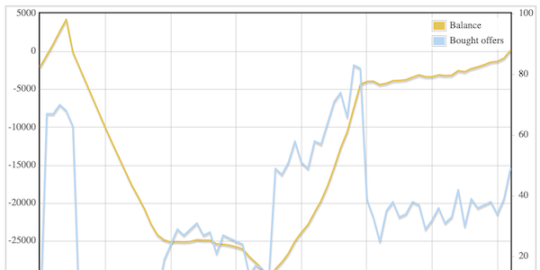
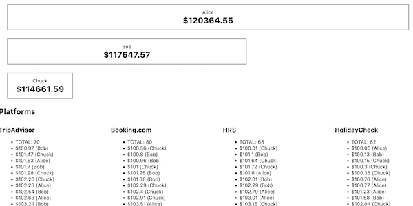

# RevMan

RevMan is a browser-based marketplace simulation game. Players join as hotels who want to sell their rooms on several online platforms. They compete against each other by setting prices, choosing platforms, and trying to gain their guests' loyalty.

RevMan was created as the base of a hackathon at [TrustYou](https://github.com/trustyou/) back in 2013. Teams were asked to implement revenue management algorithms, and play against each other on a simulated marketplace.

This project is implemented in Go, for no particular reason that I wanted to learn it. Some code is unnecessarily complex, because I'm a Go beginner and wanted to try out features. Most notably the [`util`](util/iter.go) package, which implements iterators as channels, which is neither efficient nor idiomatic.

 

## Usage

RevMan was updated since it was written, and now requires Go 1.18. To run the server:

```bash
# Run directly:
go run .
# … Or compile and run:
go build .
./revman
# Specify a port different from the default:
./revman -addr :8888
```

… Then visit http://localhost:8090/ to join the game with a default player, or http://localhost:8090/spectate.html to view statistics on a running game without joining.

## Premise

* The simulation is turn-based.
* *Hotels* (=players) have a certain number of rooms that they want to sell.
* To do that, they place *offers* (room for a certain price) on *platforms* (online booking portals).
* The game server then simulates a limited number of *guests* who decide which offer to book, if at all, at each turn. The simulation takes into account:
  * Each guest's price flexibility, which also gets updated over time. If hotel prices trend downward, guests will be less likely to pay higher rates.
  * Imperfect information. Guests look at a limited number of platforms and hotels to make their decision.
  * Loyalty. If guests have booked via a certain platform, or stayed at a certain hotel frequently, they are more likely to return to it.
* Each hotel has a monthly *fix cost*, as well as a *variable cost* for renting out a room. Their account *balance* gets updated after every round. The player with the most money wins!

## Development

### Lint & run tests

```bash
# Format all Go code with
gofmt -s -w .
# Run tests
go test -v github.com/sportsracer/revman/...
```

### Overview of files

Server:
* The [`util`](util/iter.go) package implements the iterator pattern, and some util methods on iterators, using Go channels.
* [`model`](model) contains the basic game entities. Most business logic is implemented in [`Platform`](model/platform.go) and [`Guest`](model/guest.go).
* In the [`ctrl`](ctrl) package, you'll find the [`Game`](ctrl/game.go) class which joins hotels and platforms together to form a common marketplace. As well as the actual [`Controller`](ctrl/controller.go), which translates messages received from clients into actions in the game.
* Communication between clients and servers happens over websockets, implemented in the [`server`](server) package.

The game client is implemented in [`static/client.js`](static/client.js). It contains a dummy revenue manager implementation which was replaced with an actual algorithm by hackathon participants.